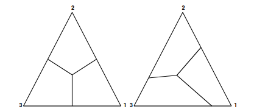

# Introduction

We're interested in a principled way to estimate classification model parameters, generate predicted classifications for new unlabeled observations, and measure classification accuracy in the presence of unbalanced data with potentially different costs for different misclassifications. To ground the exploration in context, we will consider classification of physical activity (PA) type or energy expenditure (EE) into $K=3$ classes.  For PA type, these categories may correspond to activities such as sitting, standing, and stepping; for EE, it is common to consider categories like sedentary behavior (SB), light physical activity (LPA), and moderate to vigorous physical activity (MVPA) which are obtained by discretizing an underlying continuous measure of energy expenditure.  In both of these classification settings, the first class ($k = 1$) is generally more prevalent than the second class ($k = 2$), which is in turn more prevalent than the third class ($k = 3$).  Additionally, for the purpose of a study relating EE to health outcomes it may be more important to classify the more intense activity types or energy expenditure levels correctly, and some classification errors may be more severe than others.  For example, it may be more important to classify an instance of MVPA correctly than an instance of SB; and an error that misclassifies MVPA as SB may be more severe than an error that misclassifies MVPA as LPA.

Throughout the following, we will consider a training data set of size $n$, where for each case we observe a class label $y_i \in \{1, 2, 3\}$ and some covariates $x_i$ that may be used for prediction. The goal of a classification model is to generate a predicted class label $\widehat{y}_i$, but we will focus on methods that proceed by generating predicted probabilities of membership in each class $(\widehat{p}_1(x_i), \widehat{p}_2(x_i), \widehat{p}_3(x_i))$ as an intermediate step. We also denote the proportion of the training sample that is in each class by $\widehat{\pi} = (\widehat{\pi}_1, \widehat{\pi}_2, \widehat{\pi}_3)$.

## Classification in the presence of unbalanced training data

In the presence of unbalanced classes in a training data set, a common strategy is to artificially rebalance the training data as part of fitting the classification model. This can be achieved by bootstrap resampling observations with resampling weights inversely proportional to the proportion of each class in the data set. For example, if the proportion of the sample in each class is $\widehat{\pi} = (0.5, 0.25, 0.25)$, we resample with weights $(\frac{2}{2 + 4 + 4}, \frac{4}{2 + 4 + 4}, \frac{4}{2 + 4 + 4}) = (0.2, 0.4, 0.4)$ for training set observations in each class.  In classification models where estimation is done by maximum likelihood, essentially the same effect can be achieved by adjusting the (log-)likelihood function to give more weight to observations from classes with low prevalence in the training set. In the likelihood function, this is done by raising the contribution to the likelihood from each observation to a power corresponding to the resampling weights above:

$$L_{bal}(\theta | x_1, y_1, \ldots, x_n, y_n) = \prod_{i=1}^n \left[ \widehat{p}_{y_i}(x_i \vert \theta) \right]^{1/\widehat{\pi}_{y_i}}$$

Taking logs, we arrive at a rebalanced log-likelihood with a multiplicative weight given to each observation based on the original prevalence of its labeled class:

$$\ell_{bal}(\theta | x_1, y_1, \ldots, x_n, y_n) = \sum_{i=1}^n \frac{1}{\widehat{\pi}_{y_i}} \log\left[ \widehat{p}_{y_i}(x_i \vert \theta) \right]$$

Continuing the example above, suppose that $\widehat{\pi} = (0.5, 0.25, 0.25)$ and our training set sample size is $n = 8$.  In the balanced (log-)likelihood, the four training set observations in class 1 are each given weight 2, for a total contribution equivalent to 8 unweighted observations; the two training set observations in class 2 are each given weight 4, for a total contribution equivalent to 8 unweighted observations; and again the two training set observations in class 3 are each given weight 4, for a total contribution equivalent to 8 unweighted observations.

## Cost-sensitive classification

In many settings, it is possible to specify a cost matrix $C$ where the entry $c_{jk}$ in row $j$ and column $k$ describes the cost of incorrectly assigning predicted class $j$ to an observation that has true class $k$.  We take the "cost" of accurate classification to be 0, and the costs of misclassification to be positive.  Our goal is to minimize the total cost.  If class membership probabilities are available, predicted classes can be found by minimizing the expected cost of misclassification:

\begin{align*}
\widehat{y}_i &= \mathop{argmin}_j \text{Expected cost of predicting class $j$} \\
&= \mathop{argmin}_j \sum_{k = 1}^K p_k(x_i) c_{jk}
\end{align*}

This results in a partition of the $(K-1)$-dimensional simplex of class membership probabilities into regions with different predicted classes. The boundaries of these regions are determined by the entries of the cost matrix.  Here's a figure from the article "Cost-sensitive Multi-class Classification from Probability Estimates" by O'Brien et al. with an example for three classes:



The left panel corresponds to a cost matrix where the cost of all misclassifications is the same; the right panel corresponds to a cost matrix where some misclassifications incur higher cost than others.

## Connection between rebalanced estimation and cost-sensitive classification

I think the ideas are basically the same if the off-diagonal entries of the cost matrix are equal to each other within each column, but I'm not quite sure how to write this down.  Continuing the example above, define a cost matrix

$$C = \begin{bmatrix}
0 & 4 & 4 \\
2 & 0 & 4 \\
2 & 4 & 0 \\
\end{bmatrix}$$

According to a result from O'Brien et al., we can subtract a constant from each entry in any column of this cost matrix without changing the resulting classification boundaries in the simplex.  Let's subtract 2 from the first column, and 4 from the second and third columns to obtain an equivalent cost matrix:

$$C = \begin{bmatrix}
-2 & 0 & 0 \\
0 & -4 & 0 \\
0 & 0 & -4 \\
\end{bmatrix}$$

From the cost-sensitive classification view, our goal is to obtain the class that minimizes the expected cost of classification.  Multiplying by -1, this is equivalent to maximizing the expected utility of classification.

\begin{align*}
\mathop{argmax}_j \sum_{k = 1}^K p_k(x_i) (-c_{jk}) = \mathop{argmax}_j p_j(x_i) (-c_{jj})
\end{align*}

Suppose now that the class membership probabilities $p_j(x_i \vert \theta)$ depend on parameters $\theta$ that we wish to estimate based on training set observations with observed class memberships. I basically think the above goal of choosing the class $j$ that maximizes expected utility for an observation with an unknown class turns into a goal of choosing the parameters $\theta$ that maximize expected utility for observations with known classes:

\begin{align*}
\mathop{argmax}_\theta \sum_{i=1}^n p_{y_i}(x_i \vert \theta) (-c_{y_i y_i})
\end{align*}

Questions:

 * I'm not quite sure how to make that connection more carefully.
 * Note that this expression looks very similar to the balanced log likelihood above, but each summand involves just $p_{y_i}(x_i \vert \theta)$ instead of $\log\left[p_{y_i}(x_i \vert \theta)\right]$.
 * I also don't know how to/whether it's possible to formulate a "cost-adjusted likelihood" in cases where the entries in each column are not all equal to each other.  I looked a little in the literature and didn't immediately see anything about this.  I also didn't succeed when I tried some made up stuff in the first simulation study below.

# Experimental set up

## Data generating processes

We will conduct two simulation studies.  Here we describe the data generating processes for these studies.

#### Simulation scenario 1: Gaussian mixture model

We generate $n$ observations from a mixture model with three classes:

\begin{align*}
Y_i &\sim \text{Categorical}(0.9, 0.075, 0.025) \\
X_i | Y_i = y_i &\sim \text{Normal}(\mu_{y_i}, 1) \\
\mu_1 &= 0 \\
\mu_2 &= 2 \\
\mu_3 &= 4 \\
\end{align*}

The following plot shows a representation of this data generating process in the top panel; each normal density has been scaled by the corresponding class probability so that $P(Y_i = k, X_i \in [a,b])$ is the area under the curve for group $k$ in the interval from $a$ to $b$. The lower panel shows the class probabilities from the Bayes classifier as a function of $x$.

```{r, echo = FALSE, message=FALSE}
library(dplyr)
library(ggplot2)
library(purrr)
library(gridExtra)

pi <- c(0.9, 0.075, 0.025)
mu <- c(0, 2, 4)
sigma_sq <- c(1, 1, 1)

x_grid <- seq(
  from = min(mu - 3 * sqrt(sigma_sq)),
  to = max(mu + 3 * sqrt(sigma_sq)),
  length.out = 201
)

to_plot <- purrr::map_dfr(
  seq_along(pi),
  function(k) {
    data.frame(
      k = k,
      x = x_grid,
      scaled_density = pi[k] * dnorm(x_grid, mean = mu[k], sd = sqrt(sigma_sq[k]))
    )
  }
) %>%
  dplyr::group_by(x) %>%
  dplyr::mutate(
    bayes_prob = scaled_density / sum(scaled_density)
  ) %>%
  dplyr::ungroup() %>%
  tidyr::pivot_longer(
    cols = c("scaled_density", "bayes_prob"),
    names_to = "quantity",
    values_to = "value") %>%
  dplyr::mutate(
    quantity = factor(quantity, levels = c("scaled_density", "bayes_prob")),
    k = factor(k)
  )

ggplot(data = to_plot) +
  geom_line(mapping = aes(x = x, y = value, color = k, linetype = k)) +
  theme_bw() +
  facet_wrap( ~ quantity, ncol = 1, scales = "free_y")
```

The idea is that the three classes correspond to activity type categories like sitting, standing, and stepping respectively, or to energy expenditure categories like sedentary behavior, light physical activity, and moderate to vigorous physical activity.

#### Simulation scenario 2: Discretized continuous variable

Here we consider a setting where the class $Y_i$ is obtained by discretizing an underlying continuous variable $Z_i$.  The motivating setting we have in mind is energy expenditure, where $Z_i$ is a continuous measure of energy expenditure in METs and $Y_i$ is a categorical measure of energy expenditure obtained by binning METs.  The plot below shows some simulated data, where Z represents actual energy expenditure (e.g. METs), $Y$ represents categorical energy expenditure, and $X$ is some observable signal like accelerometer "counts" that we will use to attempt to classify activity type.

The data were generated according to:

\begin{align*}
Z_i &\sim \text{Exponential}(1.5) \\
Y_i &= \begin{cases} 1 \text{ if $Z_i \leq 1.5$} \\ 2 \text{ if $1.5 < Z_i \leq 3$} \\ 3 \text{ if $Z_i > 3$} \end{cases} \\
X_i | Z_i &\sim \text{Normal}(5 Z_i, (1 + Z_i)^2)
\end{align*}

```{r}
set.seed(42)
n <- 10000
Z <- rexp(n = n, rate = 1.5)
Y <- rep(1L, n)
Y[Z > 1.5] <- 2L
Y[Z > 3] <- 3L
X <- rnorm(n, mean = 5 * Z, sd = 1 + Z)

to_plot <- data.frame(
  Z = Z,
  Y = factor(Y),
  X = X
)

p1 <- ggplot(data = to_plot, mapping = aes(x = Z, y = X, color = Y)) +
  geom_point() +
  ggtitle("Data Generation View") +
  theme_bw()

p2 <- ggplot(data = to_plot) +
  geom_point(mapping = aes(x = X, y = Z, color = Y)) +
  geom_smooth(mapping = aes(x = X, y = Z), se = FALSE, color = "black") +
  ggtitle("Classification Task View, Z available") +
  theme_bw()

p3 <- ggplot(data = to_plot, mapping = aes(x = X, color = Y)) +
  geom_density() +
  ggtitle("Classification Task View, Z unavailable") +
  theme_bw()

grid.arrange(p1, p2, p3)
```

To support the discussion below, here are the sample variances of values of Z in intervals of width 2 between 0 and 20:

```{r}
binned_sample_vars <- data.frame(
  bin_lower = 0:9 * 2,
  bin_upper = 1:10 * 2,
  sample_var = NA
)
for(i in 1:10) {
  binned_sample_vars$sample_var[i] <-
    var(Z[X >= binned_sample_vars$bin_lower[i] & X < binned_sample_vars$bin_upper[i]])
}

ggplot(
  data = binned_sample_vars,
  mapping = aes(x = bin_lower, y = sample_var)) +
  geom_line() +
  geom_point()
```

I don't actually explore this simulation study below, but the point is:

 * There are fewer observations in class 3 than in classes 1 and 2.  This means that the rebalancing approaches discussed above would give observations in class 3 more weight than observations in classes 1 and 2.
 * If the continuous outcome measure were available in the training data, you could imagine first training a classifier by building a regression model for $Z \vert X$, then discretizing the predictions from that model.  In such a model, you might reasonably say that the variance of $Z | X$ is an increasing function of $X$; in that case I think that the effective contribution to the log likelihood from observations with high energy expenditure (and so high values of $X$) would be relatively small (I'm trying to get intuition from weighted least squares).  On the other hand, those observations tend to be high leverage, so might more heavily inform the parameters of a regression model.  Figuring out the relative importance of those observations is a little tricky, but overall it doesn't seem to match up with the rebalancing weighting scheme outlined previously.

## Measures of classifier accuracy

We will consider three measures of classifier accuracy:

1. Overall classification accuracy: number of correctly classified observations divided by total number of observations.  We want this to be large.
1. Average recall: for each class, we calculate the proportion of observations in that class that are classified correctly to get a class-specific recall.  We then average these class-specific recall values across all classes.  We want this to be large.
1. Confusion cost loss:  We posit the ability to specify a numeric cost associated with each type of classification error in a confusion matrix.  For concreteness, we use the costs recorded in the table below:

```{r, echo = TRUE}
losses <- tidyr::expand_grid(
  k_true = 1:3,
  k_classified = 1:3
) %>%
  dplyr::mutate(
    loss = dplyr::case_when(
      (k_true == 1 & k_classified == 1) ~ 0.0,
      (k_true == 1 & k_classified == 2) ~ 1,
      (k_true == 1 & k_classified == 3) ~ 4,
      (k_true == 2 & k_classified == 2) ~ 0.0,
      (k_true == 2 & k_classified == 1) ~ 3,
      (k_true == 2 & k_classified == 3) ~ 6,
      (k_true == 3 & k_classified == 3) ~ 0.0,
      (k_true == 3 & k_classified == 1) ~ 10,
      (k_true == 3 & k_classified == 2) ~ 5
    )
  )

losses_matrix <- losses %>%
  tidyr::pivot_wider(names_from = "k_true", values_from = "loss") %>%
  dplyr::select(-k_classified) %>%
  as.matrix()

ggplot(data = losses) +
  geom_raster(mapping = aes(x = k_true, y = k_classified, fill = loss)) +
  geom_label(mapping = aes(x = k_true, y = k_classified, label = loss)) +
  theme_bw()
```

I made these numbers up, but the idea is that a correct classification incurs no cost, classification errors misclassifying MVPA incur a higher cost than errors misclassifying SB, and errors confusing very different activities (SB and MVPA) are more costly than errors confusing more similar activities (LPA and SB, or LPA and MVPA).  We want our total loss from misclassification to be minimized.

I think average recall might correspond to a particular choice of cost matrix?

## Classification methods

We consider a multinomial logistic regression classification model, varying the objective function used for estimating the model parameters and the rule used to obtain predicted classes from the estimated class membership probabilities.

#### 1. Bayes probabilities, most likely class

This method uses the true parameters from the data generating process to calculate class membership probabilities, and selects for each observation the most likely class.

#### 2. Bayes probabilities, minimum cost class

This method uses the true parameters from the data generating process to calculate class membership probabilities, and selects for each observation the class with minimum expected cost according to the cost matrix used in our third accuracy measure.

#### 3. Maximum likelihood, most likely class

This method uses maximum likelihood to estimate model parameters, and selects for each observation the class with highest estimated probability.

#### 4. Maximum likelihood, minimum cost class

This method uses maximum likelihood to estimate model parameters, and selects for each observation the class with minimum expected cost according to the cost matrix used in our third accuracy measure.

#### 5. Maximum "rebalanced" likelihood, most likely class

This method estimates model parameters by maximizing the rebalanced likelihood described above, and selects for observation the class with highest estimated probability.

# Simulation Study

We simulate 100 data sets, each with 200 training set observations and 10000 test set observations.  For each simulation, we fit the classifiers described above to the training set, obtain predictions for the test set, and calculate the three measures of classification accuracy for the test set predictions.

```{r, echo = TRUE}
sim_data_1 <- function(n, pi, mu, sigma_sq) {
  y <- apply(
    rmultinom(n = n, size = 1, prob = pi),
    2,
    which.max)
  x <- rnorm(n = n, mean = mu[y], sd = sqrt(sigma_sq[y]))

  return(data.frame(x = x, y = y))
}

get_most_likely_classes_bayes_rule <- function(x, pi, mu, sigma_sq) {
  purrr::map_dfr(
    seq_along(pi),
    function(k) {
      data.frame(
        k = k,
        i = seq_along(x),
        scaled_density = pi[k] * dnorm(x, mean = mu[k], sd = sqrt(sigma_sq[k]))
      )
    }
  ) %>%
    dplyr::group_by(i) %>%
    dplyr::slice_max(scaled_density) %>%
    dplyr::pull(k)
}

get_min_cost_classes_bayes_rule <- function(x, pi, mu, sigma_sq, losses_matrix) {
  class_probs <- purrr::map_dfr(
    seq_along(pi),
    function(k) {
      data.frame(
        k = k,
        i = seq_along(x),
        scaled_density = pi[k] * dnorm(x, mean = mu[k], sd = sqrt(sigma_sq[k]))
      )
    }
  ) %>%
    tidyr::pivot_wider(names_from = "k", values_from = "scaled_density") %>%
    dplyr::select(-i) %>%
    as.matrix() %>%
    sweep(1, apply(., 1, sum), "/")

  pred_costs <- class_probs %*% t(losses_matrix)

  apply(-1 * pred_costs, 1, which.max)
}


get_most_likely_classes_logistic <- function(x, intercept, beta) {
  log_class_probs <- cbind(
    rep(0, length(x)),
    intercept[1] + beta[1] * x,
    intercept[2] + beta[2] * x
  )
  apply(log_class_probs, 1, which.max)
}

get_min_cost_classes_logistic <- function(x, intercept, beta, losses_matrix) {
  class_probs <- cbind(
    rep(0, length(x)),
    intercept[1] + beta[1] * x,
    intercept[2] + beta[2] * x
  ) %>%
    exp() %>%
    sweep(1, apply(., 1, sum), "/")

  pred_costs <- class_probs %*% t(losses_matrix)

  apply(-1 * pred_costs, 1, which.max)
}

calc_accuracy_measures <- function(y, y_hat, losses_matrix, method_name) {
  class_recalls <- c(
    mean(y_hat[y == 1] == 1),
    mean(y_hat[y == 2] == 2),
    mean(y_hat[y == 3] == 3)
  )
  class_recalls <- class_recalls[!is.na(class_recalls)]

  results <- data.frame(
    method = method_name,
    accuracy_measure = c("accuracy", "ave_recall", "confusion_loss"),
    accuracy_value = c(
      mean(y == y_hat),
      mean(class_recalls),
      sum(losses_matrix[cbind(y_hat, y)])
    )
  )

  return(results)
}

multinomial_logistic_mle_model <- rstan::stan_model("multinomial_logistic_mle.stan")
multinomial_logistic_rebalanced_mle_model <- rstan::stan_model("multinomial_logistic_rebalanced_mle.stan")
```

```{r}
nsim <- 100

sim_results <- purrr::map_dfr(
  seq_len(nsim),
  function(sim_ind) {
    train_data <- sim_data_1(n = 1000, pi = pi, mu = mu, sigma_sq = sigma_sq)
    test_data <- sim_data_1(n = 10000, pi = pi, mu = mu, sigma_sq = sigma_sq)

    bayes_rule_y_hat <- get_most_likely_classes_bayes_rule(
      x = test_data$x,
      pi = pi,
      mu = mu,
      sigma_sq = sigma_sq)
    bayes_rule_max_prob_accuracy <- calc_accuracy_measures(
      test_data$y,
      bayes_rule_y_hat,
      losses_matrix,
      "bayes_max_prob")

    bayes_rule_y_hat <- get_min_cost_classes_bayes_rule(
      x = test_data$x,
      pi = pi,
      mu = mu,
      sigma_sq = sigma_sq,
      losses_matrix = losses_matrix)
    bayes_rule_min_cost_accuracy <- calc_accuracy_measures(
      test_data$y,
      bayes_rule_y_hat,
      losses_matrix,
      "bayes_min_cost")

    mle_fit <- rstan::optimizing(
      multinomial_logistic_mle_model,
      data = list(
        n = 1000, x = train_data$x, y = train_data$y
      ))
    mle_max_prob_y_hat <- get_most_likely_classes_logistic(
      test_data$x,
      intercept =
        unname(mle_fit$theta_tilde[1, c("intercept[1]", "intercept[2]")]),
      beta = unname(mle_fit$theta_tilde[1, c("beta[1]", "beta[2]")])
    )
    mle_max_prob_accuracy <- calc_accuracy_measures(
      test_data$y,
      mle_max_prob_y_hat,
      losses_matrix,
      "mle_max_prob")

    mle_min_cost_y_hat <- get_min_cost_classes_logistic(
      test_data$x,
      intercept =
        unname(mle_fit$theta_tilde[1, c("intercept[1]", "intercept[2]")]),
      beta = unname(mle_fit$theta_tilde[1, c("beta[1]", "beta[2]")]),
      losses_matrix = losses_matrix
    )
    mle_min_cost_accuracy <- calc_accuracy_measures(
      test_data$y,
      mle_min_cost_y_hat,
      losses_matrix,
      "mle_min_cost")

    rebalanced_mle_fit <- rstan::optimizing(
      multinomial_logistic_rebalanced_mle_model,
      data = list(
        n = 1000, x = train_data$x, y = train_data$y
      ))
    rebalanced_mle_y_hat <- get_most_likely_classes_logistic(
      test_data$x,
      intercept =
        unname(rebalanced_mle_fit$theta_tilde[1, c("intercept[1]", "intercept[2]")]),
      beta = unname(rebalanced_mle_fit$theta_tilde[1, c("beta[1]", "beta[2]")])
    )
    rebalanced_mle_accuracy <- calc_accuracy_measures(
      test_data$y,
      rebalanced_mle_y_hat,
      losses_matrix,
      "rebalanced_mle_max_prob")

    dplyr::bind_rows(
      bayes_rule_max_prob_accuracy,
      bayes_rule_min_cost_accuracy,
      mle_max_prob_accuracy,
      mle_min_cost_accuracy,
      rebalanced_mle_accuracy
    )
  })
```

```{r}
ggplot(data = sim_results) +
  geom_boxplot(mapping = aes(x = method, y = accuracy_value)) +
  facet_wrap( ~ accuracy_measure, scales = "free_y") +
  theme_bw() +
  theme(axis.text.x = element_text(angle = 90, hjust = 1, vjust = 0.5))
```

## Conclusions

Here are the main points:

 * Generally, the relative performance of methods according to a given accuracy measure corresponds to how the model parameters were estimated and predicted classes were obtained.  If our goal is the best overall accuracy, we should perform estimation by maximum likelihood and choose the most likely predicted class; if our goal is highest average recall, we should perform estimation either by maximizing a rebalanced likelihood (there's probably another option to do estimation by maximum likelihood and then choose classes by minimizing expected cost with a cost corresponding to the class balances); and if we want to minimize some more complex cost, we can do maximum likelihood estimation and then choose a predicted class by minimizing expected costs.
 * As a corollary, it does not make sense to compare accuracy of methods that are trained using different objective functions.  In particular, comparing accuracy or recall of a logistic regression model trained by maximum likelihood to a neural network trained by maximizing a rebalanced likelihood doesn't work because of confounding between the model specification and the estimation method.
 * I think that with unbalanced data, average recall is probably a better thing to look at than overall classification accuracy, but better still would be to try to think about what we really want our classifier to do well, try to formalize it with costs to misclassification, and account for those costs when building a classifier.
 * Question: If our real goal is to estimate total time spent in MVPA per day as accurately as possible, is it possible to translate that into a statement about costs on classification for individual time points in the day?  Do we need some sort of cost of misclassification for outcomes that are dependent throughout the day?
 * It's not clear how best to translate all of these ideas to a setting where you're going to build a classifier as a side effect of doing regression to estimate a continuous measure of energy expenditure.
